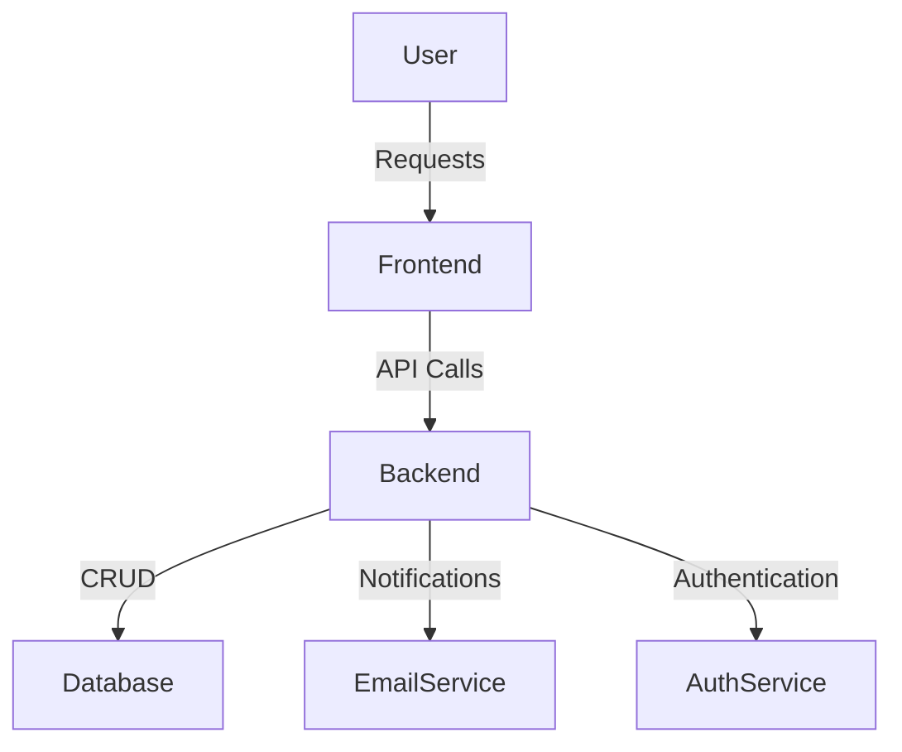

# Ticket Management System

A Ticket Management System designed to streamline the process of logging, tracking, assigning, and resolving support tickets. This system helps organizations manage customer or internal requests efficiently, ensuring accountability and transparency throughout the ticket lifecycle.

---

## Table of Contents

- [Features](#features)
- [Tech Stack](#tech-stack)
- [Architecture](#architecture)
- [Setup & Installation](#setup--installation)
- [Usage](#usage)
- [Folder Structure](#folder-structure)
- [Contributing](#contributing)
- [License](#license)
- [Contact](#contact)

---

## Features

- **User Authentication:** Secure registration and login with role-based access (Admin, Agent, User).
- **Ticket Operations:** Create, update, assign, resolve, and close tickets.
- **Status Tracking:** Multiple statuses (Open, In Progress, Resolved, Closed, Reopened).
- **Ticket Assignment:** Assign tickets to agents for efficient handling.
- **Commenting System:** Team communication and discussion on tickets.
- **Notifications:** Email or in-app notifications for ticket updates (configurable).
- **Filtering & Search:** Advanced filtering and search by status, priority, assignee, date, etc.
- **Audit Logs:** Track all ticket-related activities for accountability.
- **Reports & Analytics:** Visualize ticket trends and workloads (optional, if implemented).
- **Responsive UI:** Works on desktop and mobile devices.

---

## Tech Stack

> Update this section according to your actual implementation.

- **Backend:** Node.js (Express) / Django / Spring Boot
- **Frontend:** React.js / Angular / Vue.js
- **Database:** MongoDB / PostgreSQL / MySQL
- **Authentication:** JWT / OAuth2
- **Notifications:** Nodemailer / Mailgun / Twilio (or similar)
- **Other Tools:** Docker, Nginx, PM2, etc. (if applicable)

---

## Architecture



- Modular MVC or REST API architecture.
- Separate folders for frontend and backend code (see below).
- Environment configuration and secret management using `.env` files.

---

## Setup & Installation

1. **Clone the Repository**
    ```bash
    git clone https://github.com/divya63600/TicketManagementSystem.git
    cd TicketManagementSystem
    ```

2. **Backend Setup**
    - Navigate to backend folder:
      ```bash
      cd backend
      ```
    - Install dependencies:
      ```bash
      npm install
      ```
    - Set up environment variables:
      - Copy `.env.example` to `.env` and fill in your configuration.

    - Start the backend server:
      ```bash
      npm run dev
      # or
      node index.js
      ```

3. **Frontend Setup**
    - Navigate to frontend folder:
      ```bash
      cd ../frontend
      ```
    - Install dependencies:
      ```bash
      npm install
      ```
    - Set up environment variables if required.
    - Start the frontend dev server:
      ```bash
      npm start
      ```

4. **Database Setup**
    - Ensure MongoDB/PostgreSQL/MySQL is running and accessible using the credentials set in your `.env`.

5. **Access the App**
    - Open your browser at `http://localhost:3000` (or the port specified in `.env`).

---

## Usage

- **Register/Login:** Create an account or log in.
- **Create Ticket:** Click "New Ticket", fill in details, and submit.
- **Assign Ticket:** Admin/agent can assign tickets to users.
- **Update Status:** Change ticket status as work progresses.
- **Comment:** Collaborate with team members via comments.
- **Search/Filter:** Use filters to find relevant tickets.

---

## Folder Structure

```
TicketManagementSystem/
│
├── backend/          # API, database models, authentication, services
│   ├── controllers/
│   ├── models/
│   ├── routes/
│   ├── middleware/
│   ├── utils/
│   └── ...
│
├── frontend/         # UI components, pages, styles
│   ├── src/
│   ├── public/
│   └── ...
│
├── docs/             # Documentation and diagrams
├── .env.example      # Example environment variables
├── README.md
└── ...
```

---

## Contributing

1. Fork the repository
2. Create a new branch (`git checkout -b feature/your-feature`)
3. Commit your changes
4. Push to the branch (`git push origin feature/your-feature`)
5. Open a Pull Request

---

## License

This project is licensed under the [MIT License](LICENSE).

---

## Contact

For questions, support or feedback, please open an [issue](https://github.com/divya63600/TicketManagementSystem/issues) or contact [divya63600](https://github.com/divya63600).
